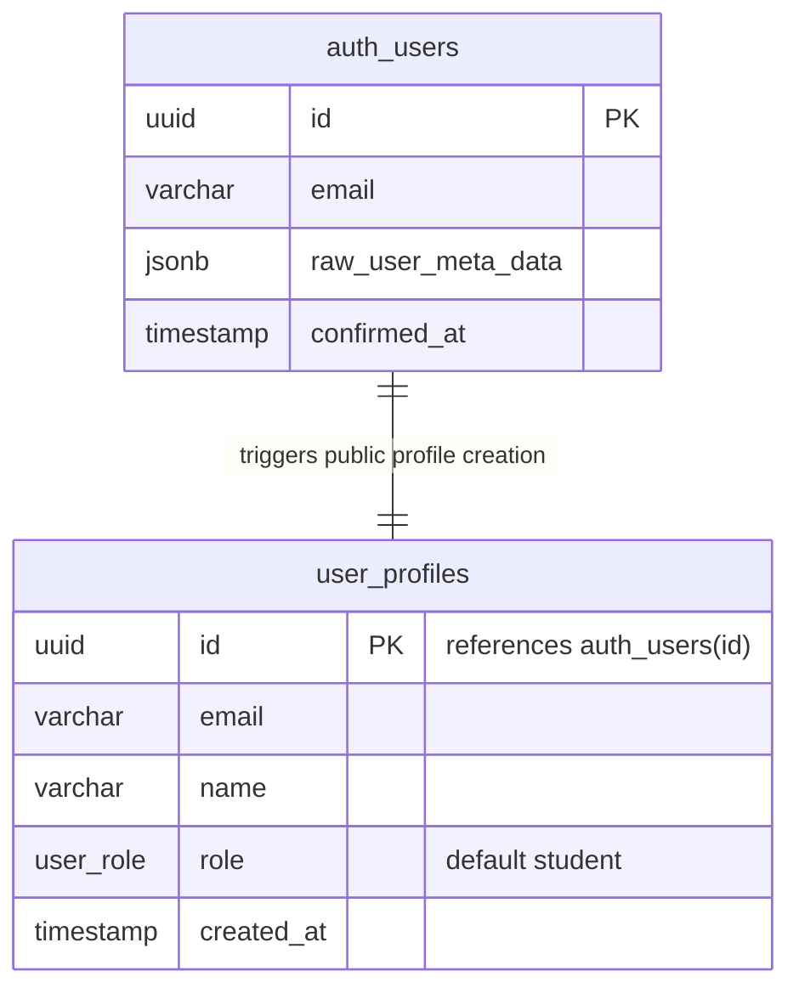

# Data Model: User Registration Options

This feature utilizes the existing database schemas and triggers. No new tables or schema migrations are required.

## Existing Schema Relationships & Behavior

### PostgreSQL Trigger: `trg_on_auth_user_created`
* **Trigger Type**: `AFTER INSERT` on `auth.users`
* **Function**: `handle_new_user()`
* **Behavior**:
  - Automatically copies the user's `id`, `email`, and the metadata `name` (from `raw_user_meta_data ->> 'name'`) to `public.user_profiles`.
  - Assigns the default role `'student'` to all newly registered users.
  - This trigger fires successfully for both Google OAuth signups and Magic Link signups.
