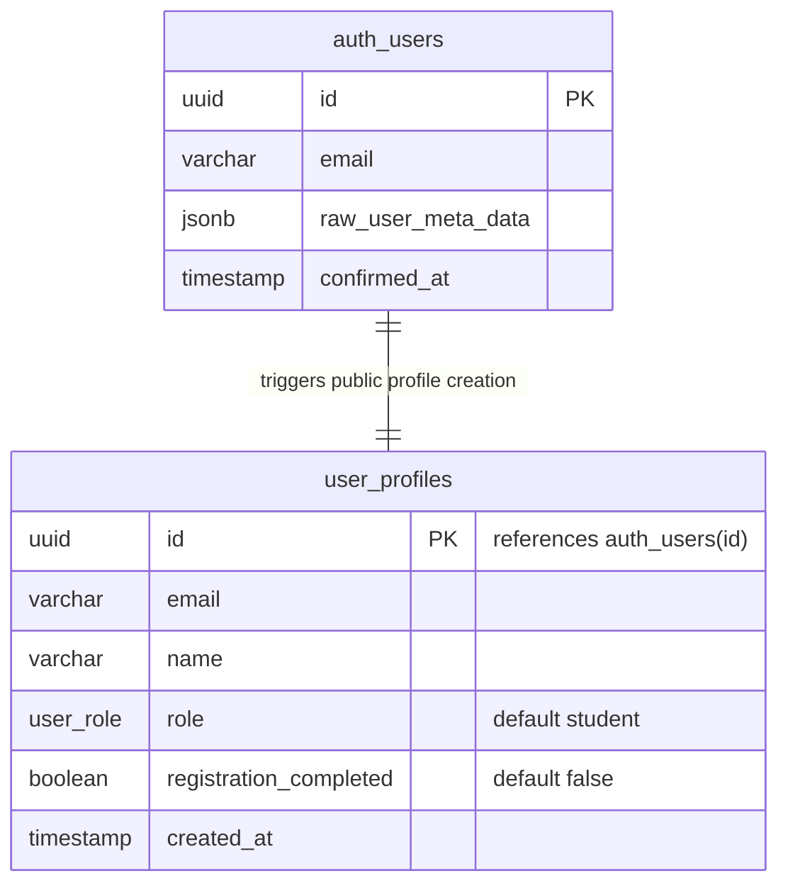
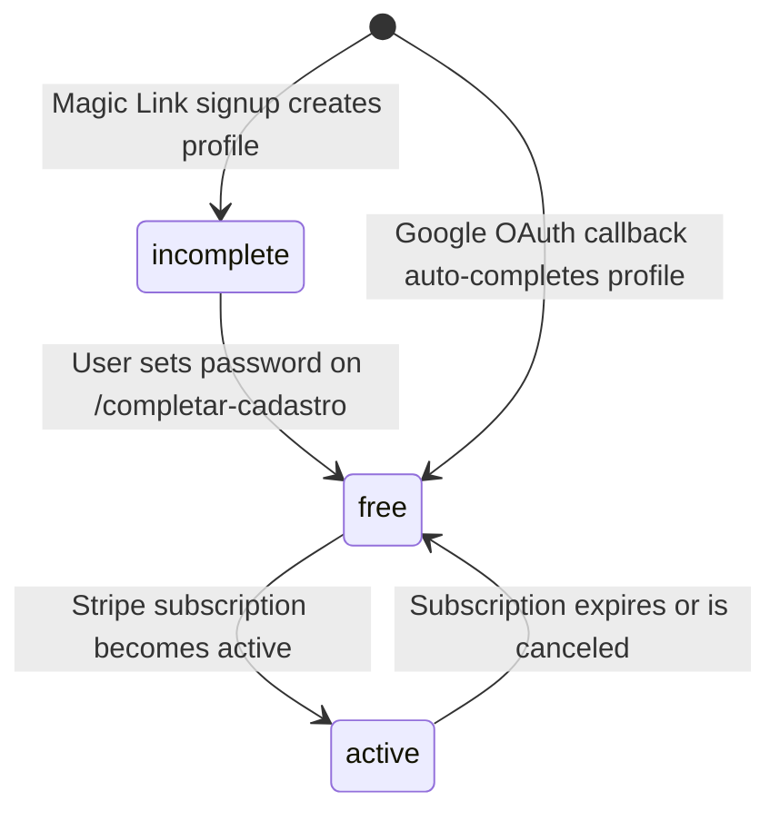

# Data Model: User Registration Options

This feature extends the existing `user_profiles` schema with one additional
registration-completion flag. No new tables are required, but a database
migration is required.

## Schema Relationships & Behavior



## Entity: User Profile

| Field | Type | Required | Rules |
|-------|------|----------|-------|
| `id` | UUID | Yes | References `auth.users(id)` |
| `email` | Text | No | Copied from Supabase Auth when available |
| `name` | Text | No | Copied from `raw_user_meta_data ->> 'name'` |
| `role` | `student`, `author`, `admin` | Yes | Defaults to `student` |
| `registration_completed` | Boolean | Yes | Defaults to `false`; `true` means password setup or Google OAuth completion is done |
| `created_at` | Timestamp | Yes | Managed by existing schema defaults |

## Migration

`supabase/migrations/008_add_registration_completed_column.sql` adds:

```sql
registration_completed boolean NOT NULL DEFAULT false
```

Existing admin, author, and seed/test profiles must be backfilled to
`registration_completed = true` so they are not redirected into the student
password-completion flow.

### PostgreSQL Trigger: `trg_on_auth_user_created`

- **Trigger Type**: `AFTER INSERT` on `auth.users`
- **Function**: `handle_new_user()`
- **Behavior**:
  - Automatically copies the user's `id`, `email`, and the metadata `name` (from `raw_user_meta_data ->> 'name'`) to `public.user_profiles`.
  - Assigns the default role `student` to all newly registered users.
  - Leaves `registration_completed = false` by default for Magic Link signups.
  - This trigger fires successfully for both Google OAuth signups and Magic Link signups.

## Registration State Transitions



| State Label | Condition |
|-------------|-----------|
| `cadastro não concluído` | `registration_completed = false` |
| `cadastro free` | `registration_completed = true` and no active subscription |
| `assinatura ativa` | `registration_completed = true` and active subscription exists |
