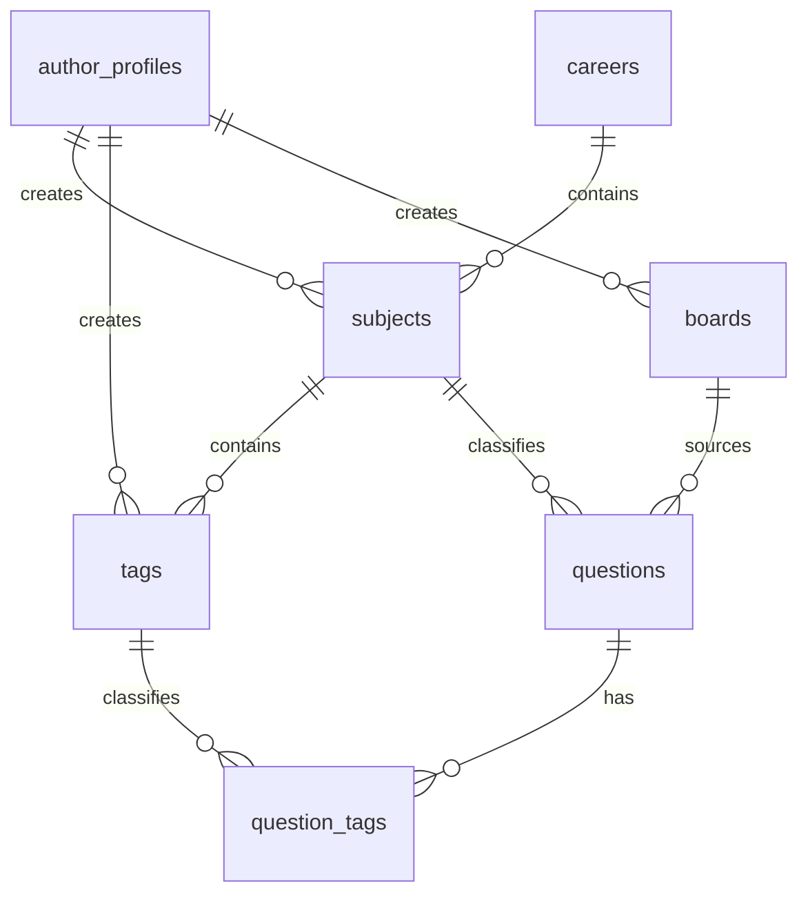
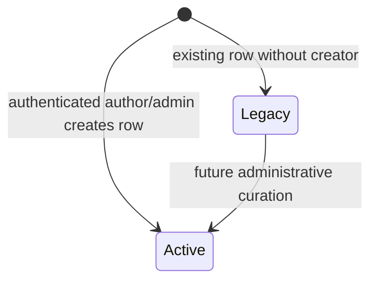

# Data Model: Catálogos de Classificação para Autores

## Relationships

## Existing Entity: `subjects` (Disciplina)

| Field | Type | Required | Rules |
| --- | --- | --- | --- |
| `id` | UUID | Yes | Primary key |
| `career_id` | UUID | Yes | References `careers.id` |
| `name` | Text | Yes | Trimmed display name |
| `slug` | Text | Yes | Accent/case-insensitive normalized identity |
| `created_by_kind` | `system`, `author`, `admin` | Yes | Defaults to `system` for legacy records |
| `created_by_author_id` | UUID | No | References public `author_profiles.id` when kind is `author` |
| `created_at` | Timestamp | Yes | Existing creation timestamp |

Uniqueness remains `(career_id, slug)`.

## Existing Entity: `tags` (Assunto)

| Field | Type | Required | Rules |
| --- | --- | --- | --- |
| `id` | UUID | Yes | Primary key |
| `subject_id` | UUID | No for legacy, yes for new records | References `subjects.id` |
| `name` | Text | Yes | Trimmed display name |
| `slug` | Text | Yes | Accent/case-insensitive normalized identity |
| `created_by_kind` | `system`, `author`, `admin` | Yes | Defaults to `system` for legacy records |
| `created_by_author_id` | UUID | No | References public `author_profiles.id` when kind is `author` |
| `created_at` | Timestamp | Yes | Existing creation timestamp |

The existing global unique constraints on `name` and `slug` are replaced by:

- Unique `(subject_id, slug)` for classified topics.
- Partial unique `slug` where `subject_id is null` for legacy topics.

New API writes always require `subject_id`. Migration 010 classifies only tags
whose associated questions all use the same discipline. Migration 011, after
the ID-based editor deploy, creates one topic per discipline for tags shared
across disciplines and rewires `question_tags`. Unassociated legacy rows remain
readable with context `Disciplina não definida`, but cannot be newly selected
until curated.

During the short compatibility window, a legacy null-discipline topic already
attached to a question may be preserved by that question's update operation.
It cannot be added to another question. This exception is removed after
migration 011 classifies all referenced legacy topics.

## Existing Entity: `boards` (Banca)

| Field | Type | Required | Rules |
| --- | --- | --- | --- |
| `id` | UUID | Yes | Primary key |
| `name` | Text | Yes | Trimmed display name |
| `slug` | Text | Yes | Globally unique normalized identity |
| `created_by_kind` | `system`, `author`, `admin` | Yes | Defaults to `system` for legacy records |
| `created_by_author_id` | UUID | No | References public `author_profiles.id` when kind is `author` |
| `created_at` | Timestamp | Yes | Existing creation timestamp |

## Existing Entity: `question_tags`

No schema change is required. The application terminology changes from tag to
assunto, while the join remains:

| Field | Type | Required | Rules |
| --- | --- | --- | --- |
| `question_id` | UUID | Yes | References question owned by the current author/admin |
| `tag_id` | UUID | Yes | References an assunto |

Before persisting joins, the service validates that all selected assuntos:

1. Exist.
2. Belong to the question's selected discipline.
3. Contain no duplicate identifiers.
4. Do not exceed the existing limit of 20.

## Creator Display

The catalog never stores `auth.users.id`. The server resolves:

| Stored state | Display |
| --- | --- |
| `created_by_kind = author` and profile is public | `author_profiles.display_name` |
| `created_by_kind = author` and profile is private/missing | `Autor` |
| `created_by_kind = admin` | `Administração` |
| `created_by_kind = system` | `Sistema` |

Only the label is returned to the browser; e-mail and private profile fields are
excluded.

## Indexes

- `subjects(created_by_author_id)`
- `tags(subject_id, name, id)`
- `tags(created_by_author_id)`
- `boards(created_by_author_id)`
- Trigram GIN indexes on catalog `slug` fields for normalized partial search.

Pagination queries always order by `name ASC, id ASC`.

## RLS and Write Rules

- Public catalog reads remain available under existing select policies.
- Insert policies allow only `author` and `admin`.
- Author inserts require `created_by_kind = author` and
  `created_by_author_id = current_author_id()`.
- Admin inserts require `created_by_kind = admin` and no author attribution.
- No author-facing update or delete operation is introduced.
- Question-topic joins remain protected by question ownership/admin policies.

## State Transitions

Editing, deactivation, merging and deletion are not part of this feature.

## Compatibility Rollout

### Migration 010 - Additive

- Adds public creator-origin fields and `tags.subject_id`.
- Backfills only unambiguous single-discipline topics.
- Adds indexes and insert policies.
- Preserves global `tags.slug` uniqueness so the currently deployed
  name-based upsert remains functional.

### Application Deploy

- Changes question payloads to `topic_ids`.
- Stops using `onConflict: 'slug'` for question saves.
- Introduces the new catalog APIs and modal.

### Migration 011 - Scoped Uniqueness

- Drops global tag name/slug unique constraints.
- Splits multi-discipline legacy tags and rewires their question associations.
- Adds unique `(subject_id, slug)` for classified topics.
- Adds partial unique `slug` for rows where `subject_id is null`.
